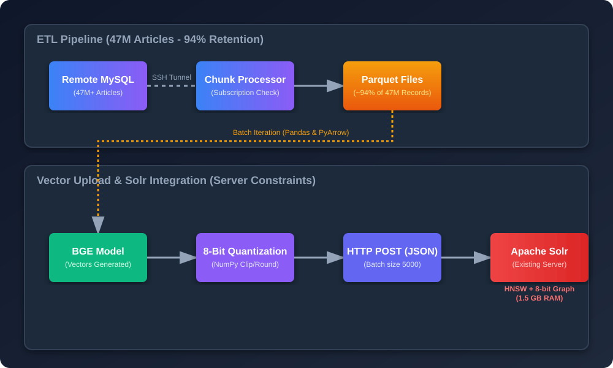

# **TL;DR:**
- A high-throughput semantic search pipeline designed to retrieve documents natively across a massive **47M+ article** database.
- Securely extracted data from a remote MySQL database via **SSH tunneling**, aggressively chunking and storing the output in **Parquet files**.
- Navigated severe server constraints by opting for the library's existing **Apache Solr** servers.
- Uploaded mathematical embeddings generated by `BAAI/bge-small-en-v1.5` into Solr using **HNSW and 8-bit quantization** to maintain strict RAM budgets.

## Tech Stack

| Category | Technologies |
| --- | --- |
| **Vector Database & Search** | Apache Solr, HNSW, 8-bit Quantization |
| **Embedding Model** | BAAI/bge-small-en-v1.5 (SentenceTransformers) |
| **Data Processing & Storage** | Python, MySQL, PyArrow, Parquet, SSH Tunneling |
| **Data Ingestion** | Python Requests, NumPy |

---

# Architecture Diagram

*High-level architecture showing the ETL pipeline extracting 47M+ articles over SSH (retaining ~94% of records), generating vectors, and uploading them using 8-bit quantization into the existing Apache Solr infrastructure which builds the HNSW index natively.*

---

# The Problem
Most of the book/article searching tools that our library systems have are based on keyword indexing only. This means that if a user searches for a term that is not exactly present in the title or description of the book/article, the search engine will not return any results. 

This is a major limitation of traditional search engines, as it does not take into account the contextual and semantic meaning of the query.

For example, if a user searches for *"Articles about machine learning usage in agricultural weather forecasting"* and a highly relevant article is titled *"Predictive Models for Crop Yield via Neural Networks"*, a standard keyword engine will fail to surface it because the exact words don't match. 

# The Solution
To solve this problem, we need to build a semantic search engine that can understand the meaning of the query and return relevant results even if the query does not contain the exact keywords present in the title or description of the book/article.

This can be achieved by using a vector database that stores the high-dimensional mathematical representations (embeddings) of the article metadata. When a user submits a query, we convert the query into an embedding and perform an approximate nearest neighbor search in the vector space, retrieving contextually identical results. 

---

# Approach in Detail

### Data Collection & Storage
- **SSH Tunneling to Remote MySQL:** The starting dataset was a massive **47Million+** articles. I fetched this dataset by establishing a secure SSH tunnel into the remote library database. To avoid overwhelming the network or blowing up system memory, I wrote a custom script (`filter_export_by_subscription_all.py`) to query the database in chunks (`100,000` rows at a time).
- **Subscription Filtering:** Before storing anything, each chunk was cross-referenced in real-time against a predefined `subscription_index`. This extraction gatekeeper logic successfully retained around **94%** of the massive 47M+ dataset, ensuring we only processed valid subscriptions without losing scale.
- **Columnar Parquet format:** Instead of dumping the data into a local SQL database or massive CSV files, I exported the validated chunks into **Apache Parquet**. This columnar format is optimized for heavy analytical queries and I/O speed.

### Embedding Generation
I used the <a href="https://huggingface.co/BAAI/bge-small-en-v1.5" target="_blank" rel="noopener noreferrer">**`BAAI/bge-small-en-v1.5`**</a> model from Huggingface to generate embeddings for the extracted fields. I chose this model specifically for these reasons:
  - It possesses the best **accuracy-to-footprint ratio** among open-source embedding models.
  - It produces **384-dimensional** embeddings, which keeps the memory footprint manageable.
  - It's blazingly fast due to its smaller size, yet semantically more accurate than many heavier models.

### Vector Database & Server Constraints
Initially, I experimented with highly advanced stacks including Qdrant, FAISS, and hybrid RRF pipelines. However, in real-world deployment, we ran into significant **server and hardware constraints**.

Loading vector data into memory is extremely heavy. Here is the mathematical breakdown of the constraints:
- **Raw Vectors**: For ~44 Million records (94% of 47M) at 384 dimensions using standard Float32 (4 bytes), the mathematical space required is `44,000,000 * 384 * 4 bytes ≈ 67.5 GB` just for the raw vectors.
- **HNSW Graph Overhead**: The Hierarchical Navigable Small World (HNSW) graph structure requires linking nodes across layers, demanding an additional `~35 to 40 GB` of memory.
- **The HDD Bottleneck**: Together, the index easily peaks at `>100 GB`. If the server lacks sufficient RAM, the operating system will swap memory to the hard disk. If the hard disk is not an ultra-fast NVMe SSD, the random disk seeks required to traverse the HNSW graph will drastically kill performance, transforming sub-second queries into minute-long timeouts. 

Because of these severe constraints and a lack of proper new servers, we pivoted. The library already operates **Apache Solr** servers which stably host the entire 47 million metadata records. 
Solr natively supports building its own HNSW vector index offline upon ingestion, effectively mimicking what Qdrant does but leveraging our existing infrastructure. 
I wrote a custom Python injection script (`upload_to_solr_IITGN_only.py`) that iteratively generated vectors and **quantized them into 8-bit integers (`np.clip(np.round(vector * 127), -128, 127)`)**. 
This 8-bit quantization shrank the vector memory footprint by 4x (`~17 GB` instead of 67 GB), allowing the existing Apache Solr server to more comfortably ingest and run the **HNSW + 8-bit** index purely in RAM without catastrophic disk spilling. 

---

# Results & Learnings

* **Constraint Engineering:** I learned how to adapt idealized architectures to rigid physical hardware constraints. By writing a robust chunking script that safely generated, quantized, and pushed vectors in batches of `5,000` via HTTP POST, the Solr integration was successful.
* **Gatekeeper Optimizations:** Pre-loading valid IDs into an `O(1)` Python `Set` allowed the script to bypass millions of unneeded vectors efficiently during ingestion.
* **Storage Optimization:** Understood the severe performance cliff when HNSW vector search relies on mechanical HDD speeds. 8-bit quantization was the perfect rescue strategy to keep data inside the rapid L3/RAM cache.

---

# Future Work

* **Lexical Indexing & RRF Fusion:** In the future, with upgraded server infrastructure, I plan to introduce a dual-engine **Hybrid Search**. By running an exact keyword/Lexical match alongside the semantic vector search, we can mathematically blend their output candidate IDs using **Reciprocal Rank Fusion (RRF)**. RRF recalculates scores based on their rank in both lists, guaranteeing that the final results are both semantically relevant *and* strictly accurate.
* **Cross-Encoder Reranking:** Integrate a cross-encoder model (like `BGE-Reranker`) as a final stage after the initial top-K fetch to re-score the matches for maximum accuracy.

---

# Links

* **GitHub Repository:** <a href="https://github.com/pro-laxmi/library" target="_blank">View Code</a>